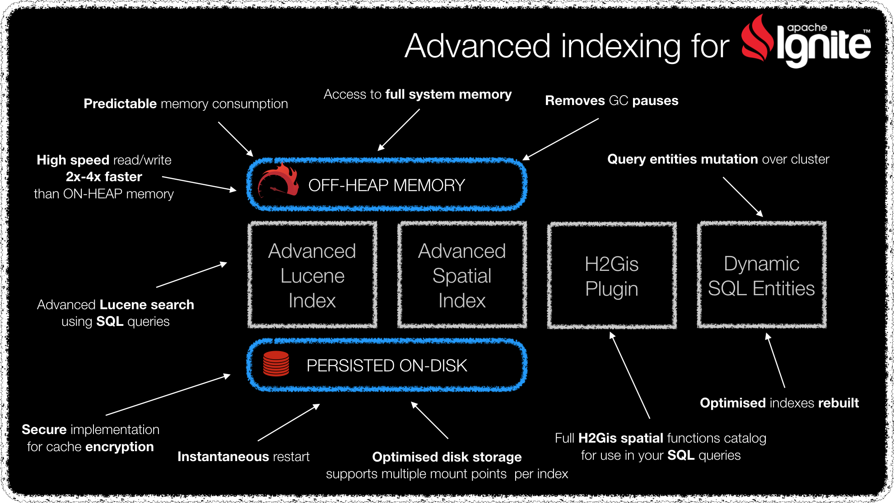

# Hawkore's extensions for Apache Ignite - samples project

Hi! This is Hawkore's extensions for Apache Ignite - samples project.

- Requirements

	-  Java >= 1.8.0_65 (OpenJDK and Sun have been tested)
	-  Maven >= 3.3.0

- Clone

	-  Clone this project: `git clone http://github.com/hawkore/examples-advanced-ignite-extensions.git`
	-  Change to directory: `cd examples-advanced-ignite-extensions`

# Content

* `ignite-server-node-test`: Start server nodes for testing Hawkore's Apache Ignite Extensions. See [README.md](ignite-server-node-test/README.md) for more info.

* `examples-advanced-ignite-indexing`: Contains sample source code for [Hawkore's Apache Ignite Advanced Indexing
](https://docs.hawkore.com/private/apache-ignite-advanced-indexing) documentation. See [README.md](examples-advanced-ignite-indexing/README.md) for more info.

Visit [Hawkore's home page](https://www.hawkore.com).